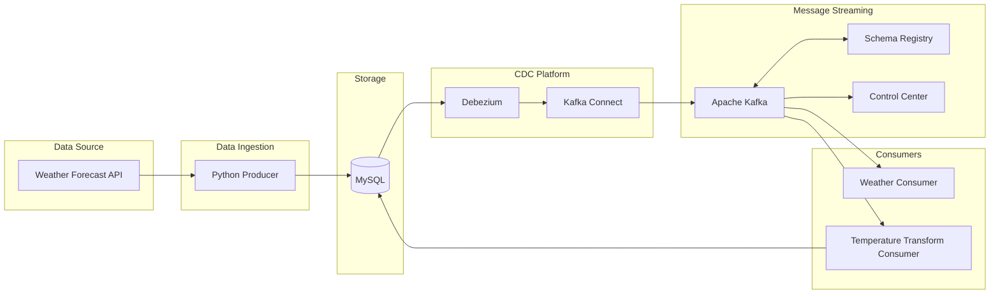

# Python Kafka Weather Data Pipeline

## Table of Contents
1. [Overview](#overview)
2. [Architecture](#architecture)
3. [Infrastructure Used](#infrastructure-used)
4. [Quick Start](#quick-start)
5. [How It Works](#how-it-works)
6. [Useful Commands](#useful-commands)
7. [Troubleshooting](#troubleshooting)
8. [CDC Samples](#cdc-samples)


## Overview
This project implements a data pipeline using Apache Kafka, Kafka Connect with Debezium for CDC (Change Data Capture), and MySQL for storing weather data.

## Architecture

The pipeline consists of:
- MySQL database for storing weather data
- Kafka Connect with Debezium for CDC
- Apache Kafka for message streaming (AVRO)
- Schema Registry for schema management
- Python producers and consumers for data processing



## Infrastructure used
* Python 3.8+
* Docker
  * [MySQL 8.0.39](https://hub.docker.com/layers/library/mysql/8.0.39/images/sha256-6b143fc1f4eab6fc9d20f383cd108c680170ff22678c5cd28551d35247fed0b3?context=explore)
  * Confluent stack v7.7.1
    * [Zookeeper](https://hub.docker.com/r/confluentinc/cp-zookeeper)
    * [Kafka Broker](https://hub.docker.com/r/confluentinc/cp-kafka) 
    * [Schema-Registry](https://hub.docker.com/r/confluentinc/cp-schema-registry)
    * [Kafka Connect](https://hub.docker.com/r/confluentinc/cp-kafka-connect) w/ [Debezium 2.4.2](https://www.confluent.io/hub/debezium/debezium-connector-mysql)
    * [Control Center](https://hub.docker.com/r/confluentinc/cp-enterprise-control-center)

## Quick Start
1. Set environment variables

Copy or rename the `.env.dist` files  to an environment variable file and edit the entries to your needs:
```bash
cp .env.dist .env
```
2. Start the infrastructure:
```bash
docker compose up -d --build
```
A folder named `var` will be created in the project root folder upon the first run. This folder includes the database files and server logs to provide help while developing.

3. Run the app
```bash
python3 main.py
```
Check the [Confluent Control Center UI](http://localhost:9021/) for graphical monitoring.

## How it works?
You have 6 containers running. Check the running containers by using the command: ``docker ps``
- **MySQL** `mysql`
    - Primary database storing weather data
    - Runs on port 3306
    - Contains two main tables:
        - weather.forecast: Stores raw weather data
        - weather.forecast_transformed: Stores temperature conversions
    - Uses binary logging for CDC (Change Data Capture)
- **Apache Kafka** `kafka`
    - Message broker running on port 9092
    - Handles all data streaming between components
    - Manages topics for:
        - CDC events (cdc.weather.forecast)
        - Schema changes (schema-changes.weather)
        - Internal configurations (docker-connect-configs)
- **Zookeeper** `zookeeper`
    - Runs on port 2181
    - Manages Kafka cluster state
    - Handles broker coordination
    - Stores Kafka configurations
- **Kafka Connect** `connect`
    - Runs on port 8083
    - Manages Debezium MySQL connector
    - Captures database changes (CDC)
    - Streams changes to Kafka topics
    - Handles data transformations
- **Schema Registry** `schema-registry`
    - Runs on port 8081
    - Manages Avro schemas
    - Ensures schema compatibility
    - Handles schema evolution
    - Provides schema validation
- **Control Center** `control-center`
    - Runs on port 9021
    - [Web UI](http://localhost:9021) for monitoring Kafka cluster
    - Provides:
        - Topic management
        - Connector status
        - Schema registry interface
        - Real-time monitoring
        - Performance metrics
### Useful commands
#### Docker Operations

```bash
# Rebuild and recreate all containers
docker compose down -v
docker compose up -d --build --force-recreate

# View logs
docker compose logs -f kafka-connect
docker compose logs -f mysql

# Inspect project network
docker network inspect python_kafka_default
```

#### Kafka Operations
##### Topics
```bash
# List topics
docker exec -it kafka kafka-topics --list --bootstrap-server kafka:29092

# Create a topic
docker exec -it kafka kafka-topics \
    --create \
    --topic <topic-name> \
    --bootstrap-server kafka:29092 \
    --partitions 1 \
    --replication-factor 1

# Delete a topic
docker exec -it kafka kafka-topics \
    --delete \
    --topic <topic-name> \
    --bootstrap-server kafka:29092
   
# Describe a topic   
docker exec -it kafka kafka-topics \
    --describe \
    --topic <topic-name> \
    --bootstrap-server kafka:9092

# Alter partitions of a topic   
docker exec -it kafka kafka-topics \
    --alter \
    --topic <topic-name> \
    --partitions <number-of-partitions> \
    --bootstrap-server kafka:9092    
```

##### Consumers (AVRO)
```bash
# Consume messages with Avro deserializer
docker exec -it schema-registry kafka-avro-console-consumer \
    --bootstrap-server kafka:29092 \
    --topic <topic-name> \
    --from-beginning \
    --property schema.registry.url=http://schema-registry:8081

# Consume with key display
docker exec -it schema-registry kafka-avro-console-consumer \
    --bootstrap-server kafka:29092 \
    --topic <topic-name> \
    --property print.key=true \
    --property key.separator=: \
    --from-beginning \
    --property schema.registry.url=http://schema-registry:8081

```

##### Consumer Groups
```bash
# List consumer groups
docker exec -it kafka kafka-consumer-groups \
    --bootstrap-server kafka:29092 \
    --list

# Describe a consumer group
docker exec -it kafka kafka-consumer-groups \
    --bootstrap-server kafka:29092 \
    --describe --group <group-name>

# Reset consumer group offsets
docker exec -it kafka kafka-consumer-groups \
    --bootstrap-server kafka:29092 \
    --group <group-name> \
    --reset-offsets --to-earliest \
    --topic <topic-name> \
    --execute
```

#### Schema Registry 
```bash
# List all subjects
curl -X GET http://localhost:8081/subjects

# List available formats/types
curl -X GET http://localhost:8081/subjects/types

# Get latest schema for a subject
curl -X GET http://localhost:8081/subjects/<subject-name>-value/versions/latest

# Delete a subject
curl -X DELETE http://localhost:8081/subjects/<subject-name>-value
```

#### MySQL Bin Log
```bash
# Check binary log status
docker exec -it mysql mysql -u<user> -p<password> -e "SHOW MASTER STATUS\G"

# Show binary logs
docker exec -it mysql mysql -u<user> -p<password> -e "SHOW BINARY LOGS"

# Show binary log events
docker exec -it mysql mysql -u<user> -p<password> -e "SHOW BINLOG EVENTS in 'mysql-bin.000001'"

# Check binary log configuration
docker exec -it mysql mysql -u<user> -p<password> -e "SHOW VARIABLES LIKE '%binlog%'"

# Enable binary logging (if needed)
docker exec -it mysql mysql -u<user> -p<password> -e "SET GLOBAL binlog_format = 'ROW'"

# Purge old binary logs
docker exec -it mysql mysql -u<user> -p<password> -e "PURGE BINARY LOGS BEFORE NOW()"
```

#### Connector API REST
Use Postman or another CLI to perform actions on each endpoint.
The [postman collection](https://github.com/mangelperis/python-kafka-practice/blob/main/utils/Kafka_Connect_API.postman_collection.json) includes all essential endpoints for:

    Listing connectors
    Creating/Updating connectors
    Checking status
    Managing connector lifecycle (pause/resume/restart)
    Viewing configurations and tasks
    Checking available plugins

## Troubleshooting

### Kafka broker error on startup
Randomly it happens that the broker crashes on startup, just shut down everything with `docker-compose down` and start again.
Check the logs for further debug:
```bash
docker logs kafka
```

### Connector settings
By default, the settings should manage any schema/stream type (JSON, AVRO...) but if you want to specify which schema and converter
to use (only) add this to the `.json` settings file (AVRO example):
```text
    "key.converter": "io.confluent.connect.avro.AvroConverter",
    "key.converter.schema.registry.url": "http://schema-registry:8081",
    "value.converter": "io.confluent.connect.avro.AvroConverter",
    "value.converter.schema.registry.url": "http://schema-registry:8081"
```
A restart of the `control-center` is required after updating connector settigns in order to make it work properly.

## CDC Samples
Check the contents [here](https://github.com/mangelperis/python-kafka-practice/tree/main/utils/cdc_samples).